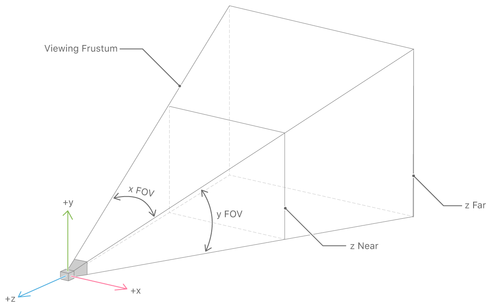
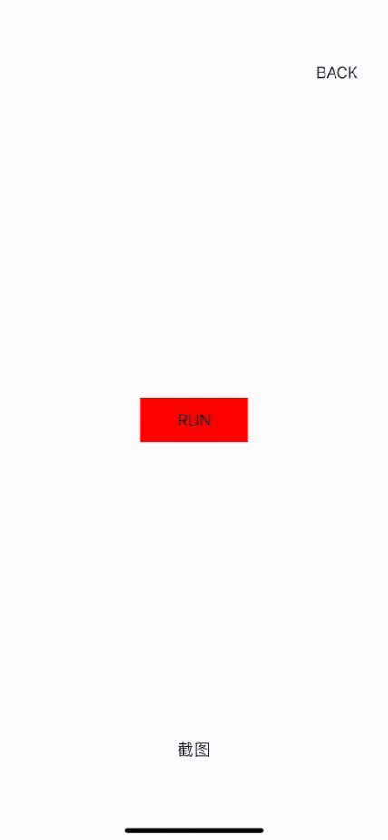

# SceneKit 展示3D模型调研


## 一、前言

Scene Kit 是一个 Objective-C 框架高性能渲染引擎。 Scene Kit 支持导入 3D 资源文件的导入、操作和渲染，不需要像 OpenGL 那样渲染场景的确切步骤。

SceneKit 使用步骤

- 导入 3d 模型，并构建由 相机、灯光、网格组成的场景
- 操纵场景中使用的边界体、几何体和材质
- 使用应用程序支持的交换格式（使用 DAE文件）创建和加载 3D 内容
- 添加与加载的 3D 内容的实时交互
- 集成其他 API（如 Core Animation 和 GLKit）,为场景中的 3D 对象添加叠加层和纹理。
- 使用 Xcode 预览、检查和调整 Scene Kit 的 DAE 文件.


## 二、Scene Kit 框架

Scene Kit 在图形架构中位于 Cocoa 之下和 `OpenGL` 之上。 与 `Quartz`、`Core Animation` 和 `GL Kit` 等技术同层，可与其他图形 API 集成实现很多不一样的效果。

因为Scene Kit 由 `Image Kit` 和 `Core Animation` 集成，所以不需要你掌握高级 3D 图形编程技能。 例如，你可以将 3D 场景嵌入到图层中，然后使用 `Core Animation` 合成功能添加叠加层和背景。 你也可以使用 `Core Animation` 图层作为 3D 场景中 3D 对象的纹理。

Scene Kit 可以导入3D 模型到你的 APP 项目中，执行以下类型的任务。

### 1、加载 3D 模型	

大多数 3D 模型无法以编程方式设计。 它们必须在 3D 创作工具（例如 3ds max、Maya 和 SketchUp）中建模，然后导入到应用程序中。 Scene Kit 可以使用 DAE 文件加载 3D 内容。支持在 app 中交换格式

加载 3D 文件后使用 Scene Kit 访问场景的所有信息，包括几何数据（以适合 OpenGL 的格式）、对象变换、动画、颜色和纹理。

### 2、操作和渲染 3D 场景
Scene Kit 框架提供了一个灵活的、基于场景图来创建和渲染虚拟 3D 场景。 凭借其基于节点的设计，Scene Kit 可抽象出大部分组件的底层内部结构。 Scene Kit 可完成大部分 GPU 渲染场景所需的所有工作。

Scene Kit 提供了三种渲染 3D 场景的方法：视图（SCNView）、图层（SCNLayer）和渲染器（SCNRenderer）。

- `SCNView` 在界面生成器中可以直接访问。 它简化了 App 在 Cocoa GUI 中的集成。
- `SCNLayer` 可以将 3D 场景集成到图层树中，利用 `Core Animation` 的布局和合成引擎。
- 当你需要在屏幕外渲染时，`SCNRenderer` 可以渲染到任意低级 OpenGL 上下文中。

### 3、3D场景添加动画

Scene Kit 可以为 3D 场景添加动画，具有与 Core Animation 相同的功能和灵活性。 Scene Kit 可以使用现有的 Core Animation API 来支持隐式和显式动画。 也可以使用 Core Animation API 隐式制作动画并创建显式动画或检索在 3D 创作工具中设计的复杂动画。

## 三、场景图


场景图基本元素是 `SCNNode`。 `SCNNode` 封装了 position、rotation 和 sacle 动画 transform。所有子节点 transform 都相对于它们的父节点 transform。客户端可以使用 `SCNNode` 对象来控制其场景的结构。

`SCNGeometry` 对象表示可附加到节点的几何图形（一组顶点和多边形）。单个几何体可以附加到多个节点，允许 Scene Kit 在场景中的多个节点之间共享潜在的大缓冲区。 SCNGeometry 对象具有一组材质，这些材质通过高级属性（漫反射、环境光、镜面反射等）描述表面的外观。 Scene Kit 还提供了一组参数化的几何图形，可以通过编程方式对其进行实例化。参数几何是一组 `SCNGeometry` 的子类。每个子类都定义了一个特定的形状，可以使用一组参数进行配置。

`SCNCamera` 对象代表一个观点。它也可以附加到任何节点。

`SCNLight` 对象代表一个光源。它可以附加到任何节点，并从其附加节点照亮整个场景。

### 合成 OpenGL 

你不需要了解 OpenGL 即可使用 Scene Kit。 如果你已经熟悉 OpenGL，仍然可以将 Scene Kit 集成到你的应用程序中。 使用 Scene Kit 加载场景，然后使用自己的渲染器进行渲染。 但是，如果你想从 Scene Kit 自己的渲染中受益，可以通过三种方式将您的 OpenGL 代码与 Scene Kit 中的渲染混合。

### 设置代理

```
node.rendererDelegate = aController;
```

设置代理后，它控制特定节点的呈现。 Scene Kit 将所有转换信息传递给该节点的代理。 然后代理在 Scene Kit OpenGL 上下文中执行自定义 OpenGL 代码。

### 使用代理渲染 OpenGL 代码

SCNView、SCNLayer 和 SCNRenderer 对象有代理属性，可以在渲染场景之前和之后执行自己的 openGL 代码。 例如，如果您想使用 OpenGL 绘制一些自定义背景或叠加层，可以用设置代理去执行。


### 四、其它

### Scenkit 的坐标系(笛卡尔坐标系)


### 资源文件格式说明

`obj`格式文件实际包含3个类型文件`.obj`、`.mtl `和`.jpg`的渲染图片，`.obj`是未渲染的3D模型，`.mtl`文件（Material Library File）是材质库文件，描述的是物体的材质信息


### 五、API

### 1、SCNLight 灯光

SCNLight 被称为灯光,没有光线的话,我们是看不到物体的,在游戏中也是一样的,我们可以给游戏中添加不同的灯光,来模拟逼真的环境。


### 2、SCNCamera 相机

SCNCamera 被称为照相机或者摄像机,游戏就相当于一个生活中的环境,我们可以通过照相机捕捉到你想要观察的画面。


- `position`: 相机位置
- `fieldOfView`：视觉，默认60°，值越大视野范围越广
- `focalLength`：焦距，默认5（50mm），值越少看到的物体越远
- `automaticallyAdjustsZRange `: 自动调节最近和最远距离，默认关闭
- `zNear`：相机能照到的最近距离，默认1m
- `zFar`：相机能照到的最远的距离，默认100m


相关属性关系图：




### 3、SceneNode 节点

SCNNode 被称为节点,一个大型的游戏场景结构就是由无数个小的节点组成,它有自己的位置和自身坐标系统,我们可以把几何模型，灯光，摄像机的游戏中的真实元素，吸附到SCNNode 节点上

### 4、SCNView 

SCNView主要作用是显示SceneKit的3D内容,是UIView 的子类,它可以添加到我们的视图中去

渲染帧率

```Swift 
preferredFramesPerSecond // 帧率越高, CPU越高
```

抗锯齿，默认是关闭的

```Swift 
 scnView.antialiasingMode = SCNAntialiasingModeMultisampling4X;

```

截屏

```Swift 
scnView.snapshot()

```

### 5、SCNScene

SCNScene 为游戏中的场景,简单的说,就是放的游戏元素(地图,灯光,人物的游戏元素)的地方。

### 6、SCNAction

SCNAction 主要负责改变节点的属性,比如我们要让一个地球围绕太阳旋转,一个气球从一个地方移动另外一个地方。


## 六、遇到的坑，以及爬坑过程

1、设置 `allowsCameraControl = true` 后出现多个双指，3指都能滑动问题

实际我们只需要单指滑动（UIPanGestureRecognizer）和 双指粘合手势 （UIPinchGestureRecognizer）

解决方案:  遍历 sceneView 的所有手势,并禁掉无用手势

```Swift

for gesture in sceneView.gestureRecognizers ?? [] {
    if let g = gesture as? UIPanGestureRecognizer {
        g.minimumNumberOfTouches = 1
        g.maximumNumberOfTouches = 1
//                g.delegate = self
    }
    else if gesture is UIPinchGestureRecognizer {
        gesture.isEnabled = true
    }
    else  {
        gesture.isEnabled = false
    }
}
        
```

2、3D转场动画层级问题

当我在`ViewDidLoad`添加如下代码时并且在做3D转场矩阵变换动画时，会把 `contentView`移到顶层

```Swift 
view.addSubview(contentView) // 1
view.addSubview(sceneView)   // 2

// 动画代码
var transform = CATransform3DIdentity
transform.m34 = 0.002
transform = CATransform3DRotate(transform, Double.pi/2, 0, -1, 0)
// 翻转动画
UIView.animate(withDuration: 0.37) {
    self.contentView.layer.transform = transform
} completion: { _ in
    // FMSLog("self: \(self.contentView)")
}

```

解决方案：将zPosition值设置大一点

```Swift
sceneView.layer.zPosition = 999
```

3、模型无法调整缩放范围

设置 `allowsCameraControl = true` ，看了 SceneKit，并没暴露对模型进行缩放范围的属性。
系统自带的缩放原理是设置相机节点的焦距 （focalLength）

解决办法：把自带的`UIPinchGestureRecognizer` 手势禁掉，自己撸一个粘合手势

```Swift
/// 自定义缩放手势
let pinch = UIPinchGestureRecognizer(target: self, action: #selector(onSceneViewPinch(_:)))
pinch.delegate = self
sceneView.addGestureRecognizer(pinch)

@objc private func onSceneViewPinch(_ pinch: UIPinchGestureRecognizer) {
    if pinch.numberOfTouches < 2 {
        return
    }
    // TIPS: pinch state有时不走.end 好坑啊。
    // 得用个变量在下次开始是将上传的scale赋值给这个变量
    if pinch.state == .began {
        focalLength = endFocalLength
    }
    
    let delta = (pinch.scale - 1) * 20
    var currFocalLength = delta + focalLength
    FMSLog("currFocalLength:\(currFocalLength)")
    /// 设置最大缩放、最小缩放
    currFocalLength = min(currFocalLength, maxFocalLength)
    currFocalLength = max(currFocalLength, minFocalLength)
    
    if #available(iOS 11.0, *) {
        cameraNode?.camera?.focalLength = currFocalLength
    }
    endFocalLength = currFocalLength
}
    
```

4、纹理无法渲染

解决办法：

```Swift
let childNode = sceneView.scene?.rootNode.childNode(withName: firstNodeName, recursively: true)
let metarial = childNode?.geometry?.materials.last
metarial?.lightingModel = .physicallyBased
metarial?.diffuse.contents = UIImage(named: grainName)     // 渲染纹理
// 这个属性才是关键，默认是白色（UIColor.white）
// 1.如果不赋值, 纹理会显示不出来，会显示白色
// 2.赋值后，如果没有灯光，模型会显示赋值的颜色
// 3.赋值后，如果有灯光，模型纹理才会显示出来
metarial?.emission.contents = UIColor.clear
sceneView.scene?.rootNode.addChildNode(childNode!)
```

5、渲染出的纹理有色差 或 模型变黑

这里可能是多种因素引起，我这里是因为没有设置灯光。可使用系统自带的灯光或自定义灯光节点

解决办法:

```Swit 
/// 默认灯光
sceneView.autoenablesDefaultLighting = true

// 周围光
let light1 = SCNNode()
light1.light = SCNLight()
light1.light?.color = UIColor.white
light1.light?.type = .ambient
light1.light?.intensity = 600			
light1.light?.zNear = 0
light1.position = SCNVector3(x: 0, y: 180, z: 100)
light1.rotation = SCNVector4(1, 0, 0, Float.pi/2.0)
sceneView.scene?.rootNode.addChildNode(light1)
    
// 定向光
let light2 = SCNNode()
light2.light = SCNLight()
light2.light?.color = UIColor.white
light2.light?.type = .directional
light2.light?.intensity = 1200
light2.light?.zNear = 0
light2.position = SCNVector3(x: 0, y: 320, z: 100)
light2.rotation = SCNVector4(-1, 0, 0, Float.pi/2.0)
sceneView.scene?.rootNode.addChildNode(light2)
```

6、3D转场动画默认会把```frame.origin.x ```设置成 ```screenWidth*0.5```

解决办法：

这个问题好奇怪，可能是SnapKit约束造成，改用 frame 来设置设置布局就解决了


### 未解决的坑

- 展示不同模型时位置、角度、缩放该如何去适配
- 出场动画 镜头归位时动作太大


## 运行效果




## 参考：

[SceneKit Programming Guide](https://developer.apple.com/library/archive/documentation/3DDrawing/Conceptual/SceneKit_PG/Introduction/Introduction.html
)

[SceneKit Documentation
](https://developer.apple.com/documentation/scenekit/)

[SceneKit to show 3D content in Swift 5](https://litoarias.medium.com/scenekit-to-show-3d-content-in-swift-5-5253afbe63b1)


